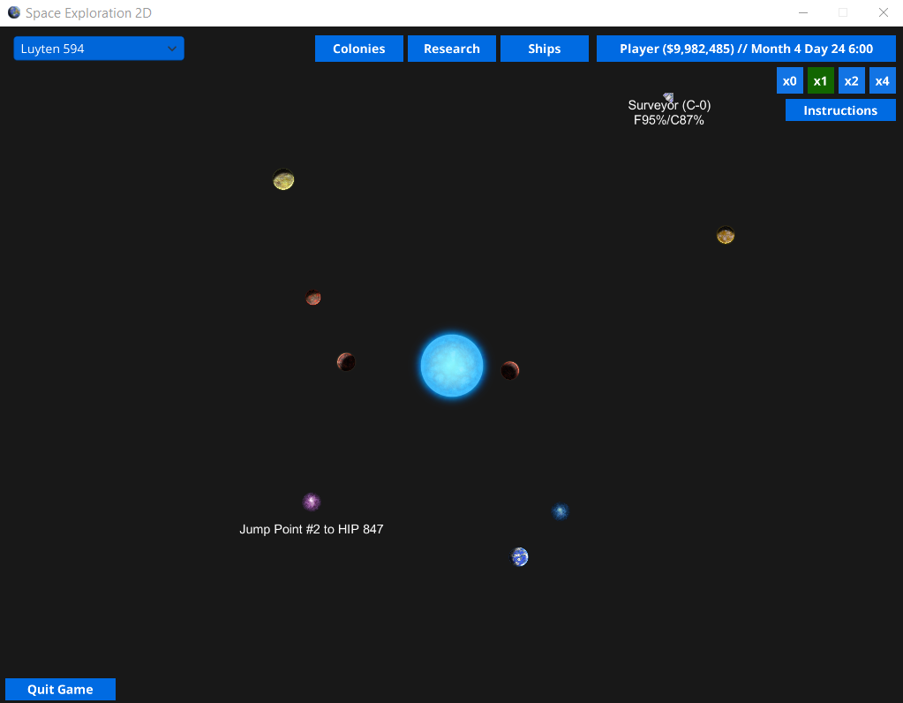
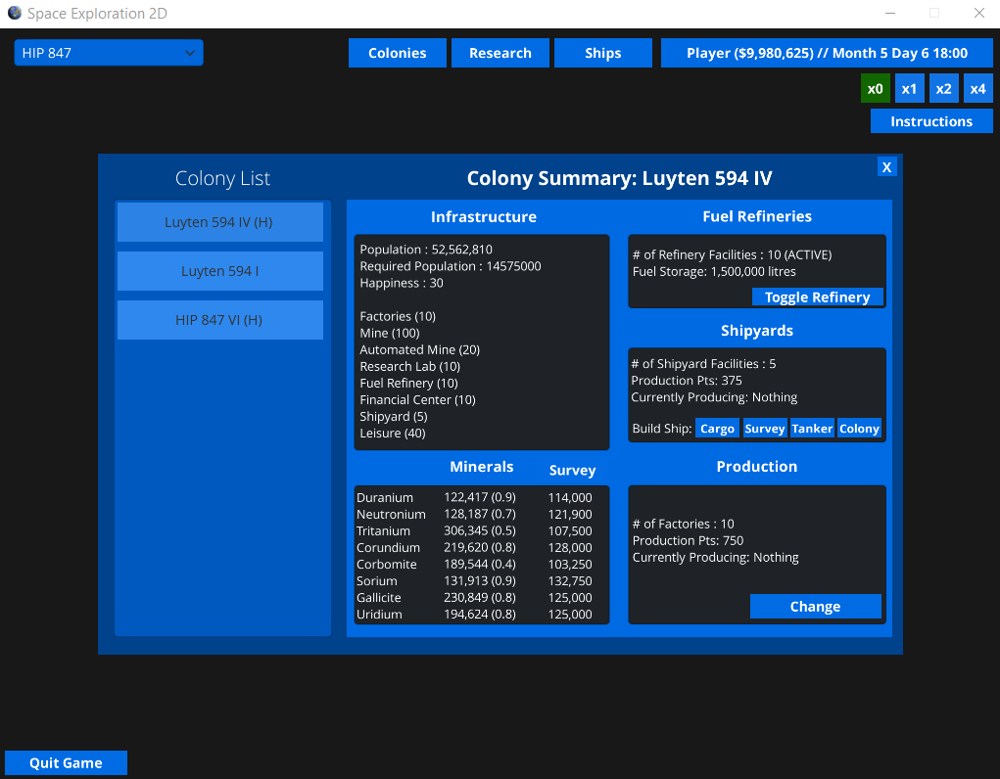

# Space Exploration 2D

Space Exploration 2D is a game implementing the basic features of Aurora 4X by Steve Walmsley. Players take lead of a space-faring civilization initially confined to a single habitable world. By building spaceships to survey nearby celestial bodies and jump points to new star systems, players strive to discover new star systems to uncover worlds which may be potentially habitable or mineral-rich. Through the use of cargo and colony ships, they can then colonize new planets and set up outposts to mine for resources and produce goods. 

